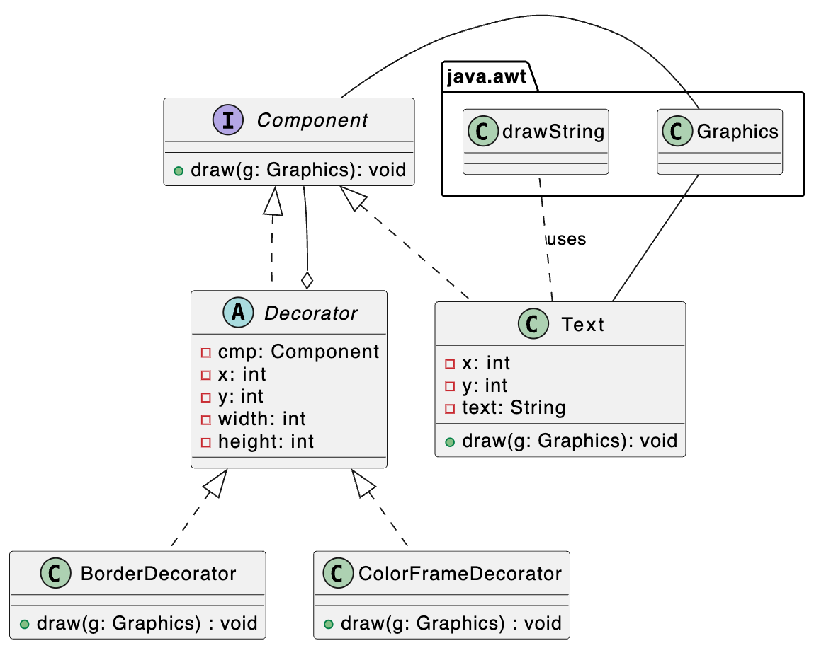
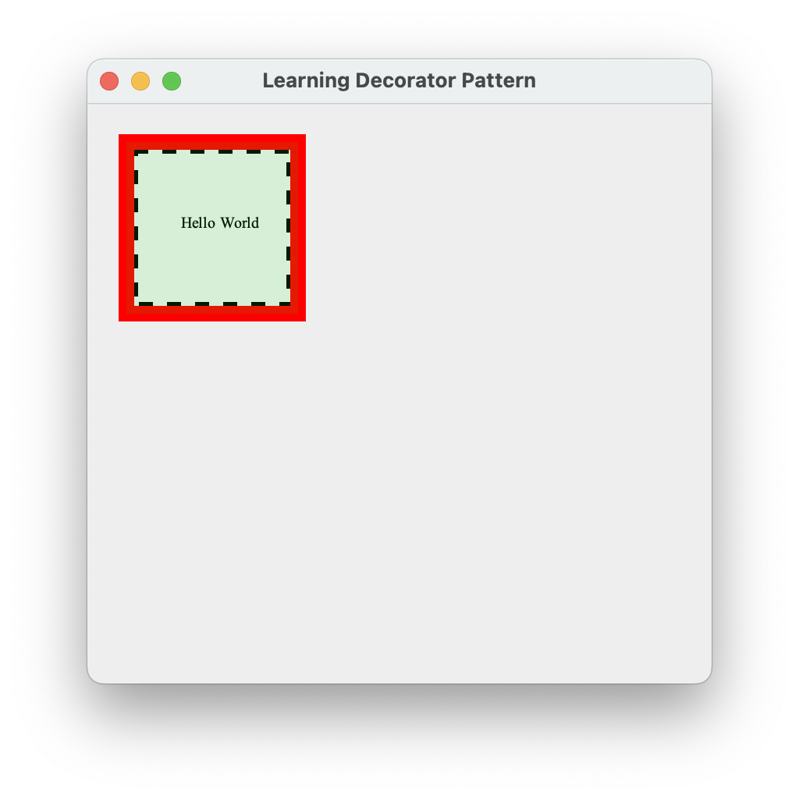

# Decorator Design Pattern

To implement this task, refer to the following UML diagram.

Now let’s assume you need to add another decorator. But this time object text must be covered with transparent green-
glass cover. You should add a new class called ColouredFrameDecorator that decorates the text area with the new decorating feature with a green glass.

### Program Output

