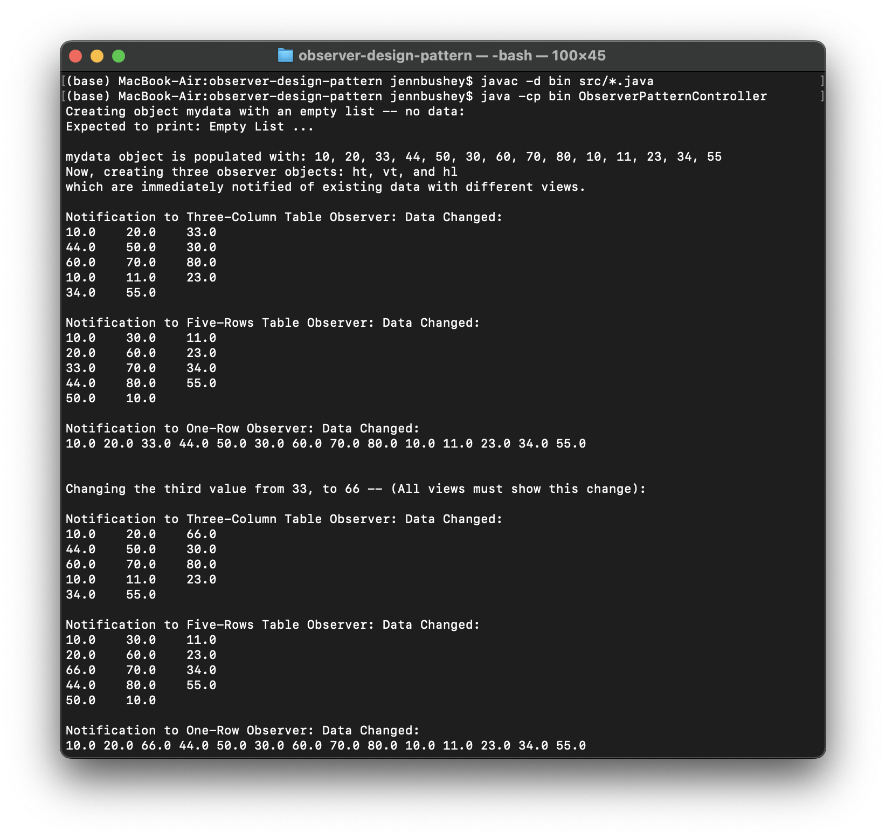
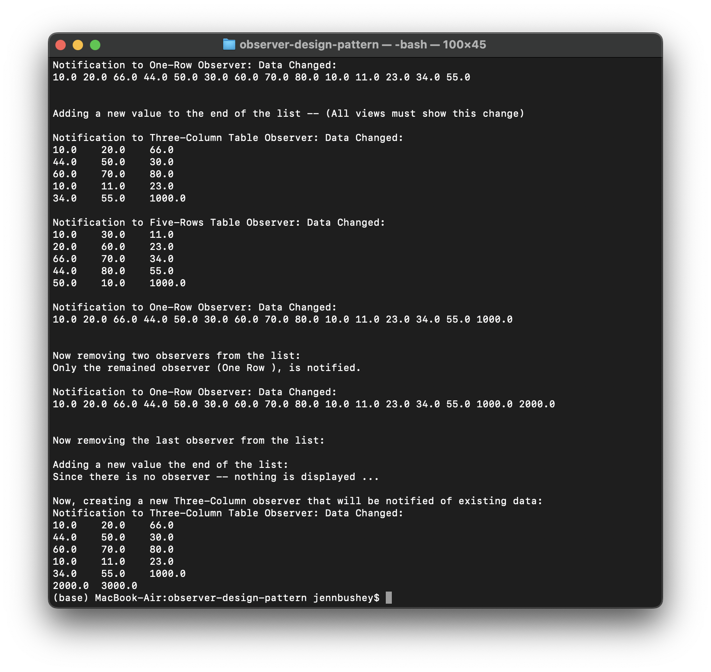

# Observer Design Pattern

For the purpose of this exercise you just need to have three observers, and your design must be very flexible
for change. In other words at anytime you should be able to add a new observer or remove an observer without any changes to the
subject or observer classes. Your program must have the following interfaces and classes:

-   Interface Observer with the method update that receive a parameter of type ArrayList<Double>
-   Interface Subject with the required methods.
-   Class DoubleArrayListSubject, with a data list of type ArrayList<Double>, called data that is supposed to be visible to
    the observers. Consider other data members as shown in the Observer Pattern Design Model. This class should also have at least the following methods:
-   A default constructor that initializes its data members as needed. For example should create an empty list for its member
    called data.
-   Method addData that allows a new Double data to be added to the list
-   Method setData that allows changing the data at any element in the list
-   Method populate that populates the list with the data supplied by its argument of the function, which is an array of
    double.
-   Other methods as needed
-   Three concrete Observer classes as follows:
-   Class FiveRowsTable_Observer This class should have a function display that shows the date in 5 rows as illustrated in following example (any number of columns, as needed):

        10 30 11
        20 60 23
        33 70 34
        44 80 55
        50 10

    This class should also have a constructor to initialize it data member(s) as needed and to register the object as an
    observer.

-   Class ThreeColumnTable_Observer that displays the same list of data in tabular format as illustrated in the
    following example (3 columns and any number of rows as needed):

        10 20 33
        44 50 30
        60 70 80
        10 11 23
        34 55

    This class should also have a constructor to initialize it data member(s) as needed and to register the object as an
    observer.

-   Class OneRow_Observer that displays the same vector of data in single line as follows:

        10 20 33 44 50 30 60 70 80 10 11 23 34 55

    This class should also have a constructor to initialize its data member(s) as needed and to register the object as an
    observer.

### Program Output

