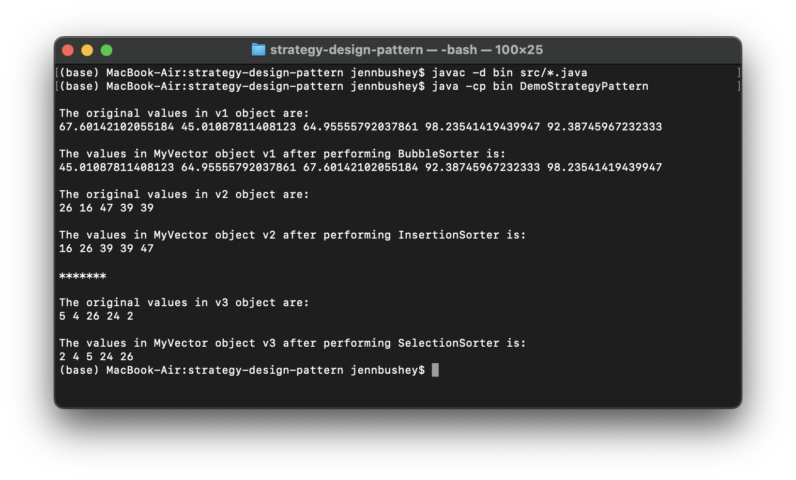

# Strategy Design Pattern

Assume as part of a team of the software designers you are working on an application that allows its clients to be able to use different sort methods for a class called MyVector. For the purpose of this exercise, you just need to implement two sort methods: bubble-sort, and insertion-sort. And of course, your design must be very flexible for possible future changes, in a way that at anytime the client objects should be able to add a new sort technique without any changes to the class MyVector (for the generic version will be MyVector<E>).

Please follow these steps:

1. Download file DemoStrategyPattern.java form D2L. This file provides a client class in Java that must be able to
   use any sort techniques at the runtime.
2. Download file called Item.java This is a class that represents data object. It means its private data member item can be
   used and sorted within the body of MyVector objects.
3. Now your program must have the following classes:

-   Class MyVector (or MyVector <E> which is also Bound to only Java Number type and its decedents). This class should have
    a private data member called storageM of type ArrayList<Item> (or ArrayList< Item<E> > for the generic version),
    which provides space for an array of certain size, and more data member as needed, and a second private data member called
    sorter that is a reference to an object of the Java interface Sorter (or interface Sorter <E> for the generic version).
    Class MyVector should also have at least two constructors as follows:
    -   A constructor that receives only an integer argument, n, to allocate memory for an array with n elements.
    -   A constructor that receives only an ArrayList object, arr, and makes storageM an exact copy of arr.
-   Also must have at least the following methods, which are used in the client class DemoStrategyPattern:
    -   `public void add(Item value):` That allows to add a new Item value to storageM
    -   `public void setSortStrategy(Sorter s):` That allows its - private data member register with a an object that
        implements Sorter.
    -   `public void performSort():` That allows sort method of any sorter object to be called.
    -   `public void display():` That displays data values stored in storage on the screen in one line. For example: 1.0
        2.0 3.0 4.0 5.0
-   Two Concrete classes called BubbleSorter and InsertionSorter that one implements a bubble sort algorithm and the other one implements insertion sort algorithm.

Now, add a new algorithm called SelectionSorter that uses selection-sort and can be used by the class client without making any changes to the class MyVector.

### Program Output

