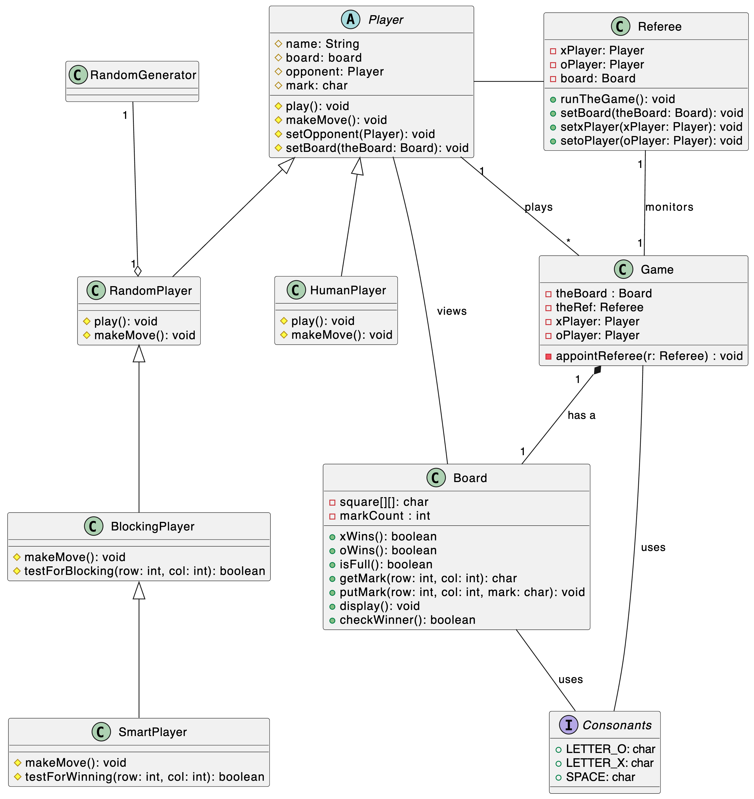
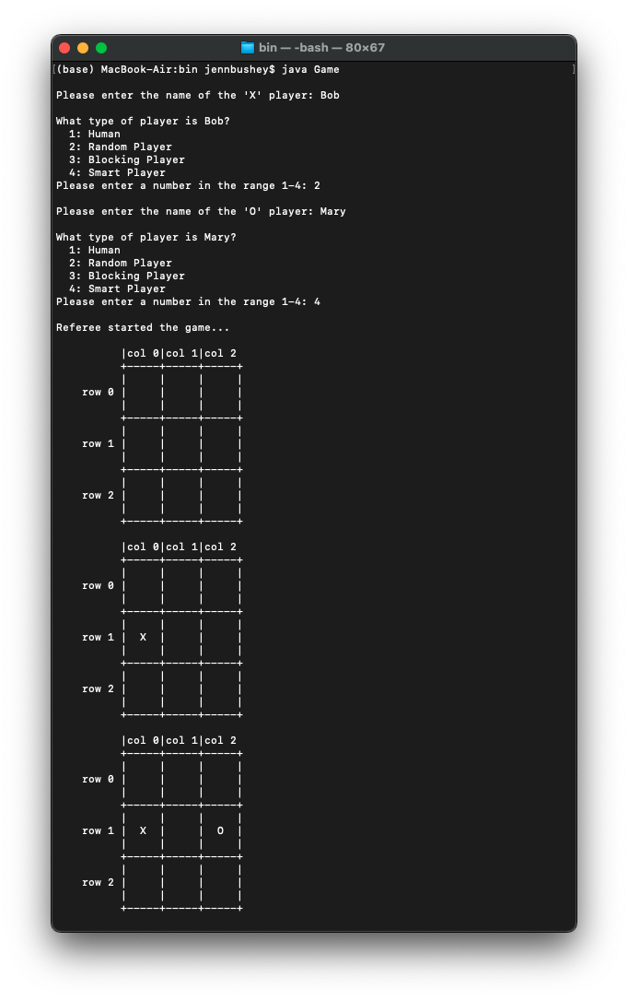
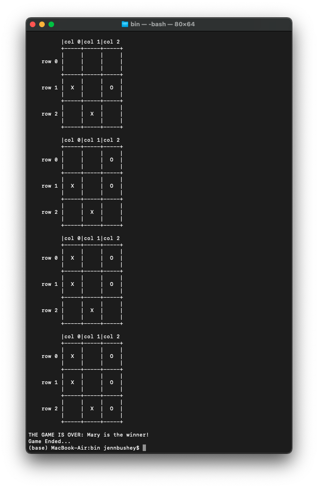

# Tic-Tac-Toe

Create a command line Tic-Tac-Toe Game.

### Class Diagram

### Responsibilities of Each Class

A Brief Description on Class HumanPlayer: HumanPlayer is a sub-class of class Player. It is a concrete class and it has to define the abstract methods inherited from class Player. As the following sample run shows in this new version of the game the players should have the option of selecting the type of the players. In this example, Mike and Judy, the two players selected the first option (i.e. human player).

A Brief Description on Class RandomPlayer: RandomPlayer is also a kind of Player. In fact, this is a computer-player that uses a random generator and picks a vacant spot on the board, randomly. The following example shows part of the game between a human (Mike) and his computer. As you can see in the sample run, Mike’s Computer plays randomly and places an O- mark in a randomly selected empty place immediately after Mike moves, and without any interaction for entering the row or the column number.

A Brief Description on Class BlockingPlayer: A BlockingPlayer is kind of RandomPlayer that first looks at the board for a move that would block its opponent from winning on the next move. If it can't find any such move, it picks a vacant spot at random. Therefore, before making any move, this class needs to call a method called testForBlocking. This method should return true if there is a situation that needs to be blocked. In other words, the process is to traverse through the board, and call testForBlocking method for each spot (ith row and jth column). If the function returns true for any of the ith row and jth column, put a mark in that spot, otherwise select an empty random spot (same as RandomPlayer).

A Brief Description on Class SmartPlayer: A SmartPlayer is a kind of BlockingPlayer,
but slightly smarter and takes the following steps to move:

-   First looks at board, if it can find a move to win immediately, it makes that move.
-   Otherwise, it looks for a way to block its opponent’s from winning on the next move.
-   Otherwise, it picks a vacant square at random.

### Program Output

